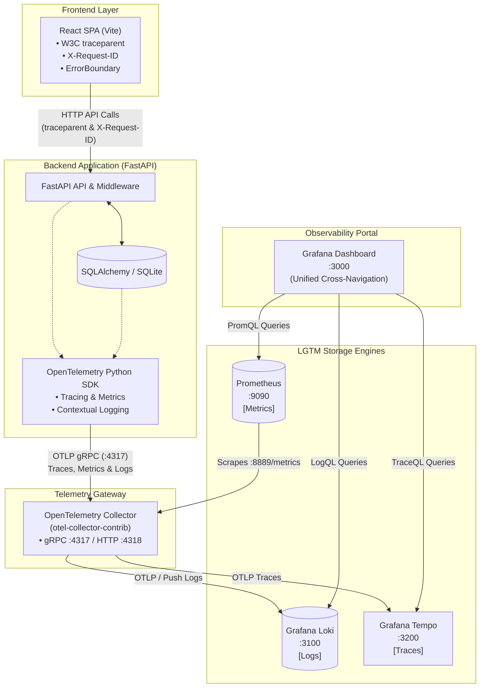
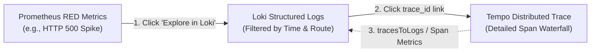
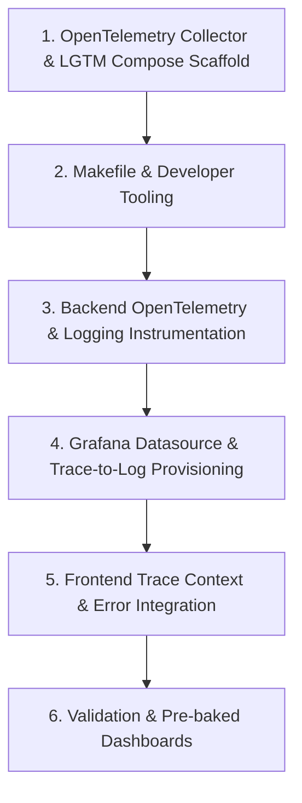

# Observability Architecture & Design: OpenTelemetry + LGTM Stack

This document defines the observability design and implementation plan for **bunny.react-fastapi**, standardizing on **OpenTelemetry** and the **LGTM** (Loki, Grafana, Tempo, Mimir/Prometheus) stack.

---

## 1. Architecture Overview

The LGTM stack provides a unified, open-source, vendor-neutral observability platform. All telemetry (logs, metrics, traces) originates from the application, enters a central **OpenTelemetry Collector**, and is routed to dedicated storage engines unified under **Grafana**.



---

## 2. Component Inventory & Container Images

| Layer | Component | Docker Image / Package | Default Ports | Primary Role |
| :--- | :--- | :--- | :--- | :--- |
| **App Telemetry** | OpenTelemetry Python SDK | `opentelemetry-sdk`, `opentelemetry-instrumentation-fastapi`, etc. | In-process | Emits traces, metrics, and logs over OTLP |
| **Router / Gateway** | OpenTelemetry Collector | `otel/opentelemetry-collector-contrib:latest` | `4317` (gRPC), `4318` (HTTP), `8889` (prom metrics) | Buffers, batches, enriches, and fans out signals |
| **L - Logs** | Grafana Loki | `grafana/loki:latest` | `3100` | Log indexing and storage by label streams |
| **G - Visualizer** | Grafana | `grafana/grafana:latest` | `3000` | Unified UI for metrics, logs, traces, and correlation |
| **T - Traces** | Grafana Tempo | `grafana/tempo:latest` | `3200` (HTTP query), `4317` (OTLP ingester) | High-volume, distributed trace storage |
| **M - Metrics** | Prometheus (or Mimir) | `prom/prometheus:latest` | `9090` | Time-series metrics engine scraping OTel Collector |

### Storage Engines & Persistence (What DB Does Each Tool Use?)

None of these tools require you to install an external database (like PostgreSQL, MySQL, or Elasticsearch). They all use embedded, purpose-built engines:

| Component | Storage Engine / Database | Location in Container / Volume | Description |
| :--- | :--- | :--- | :--- |
| **Prometheus** | **Built-in TSDB (Time-Series DB)** | `/prometheus` (`prometheus-data` volume) | Prometheus has its own custom, highly compressed time-series engine written in Go. It writes data in 2-hour blocks with a Write-Ahead Log (WAL). |
| **Grafana** | **Embedded SQLite (`grafana.db`)** | `/var/lib/grafana` (`grafana-data` volume) | Stores application configuration: users, dashboards, datasources, and alerts. (Can optionally use external Postgres in enterprise HA, but SQLite is standard). |
| **Loki** | **Native TSDB + Compressed Chunks** | `/loki` (`loki-data` volume) | Uses an embedded TSDB index for stream labels and stores compressed log streams in chunk files on the local filesystem. |
| **Tempo** | **Direct-to-Disk Block Storage** | `/tmp/tempo` (`tempo-data` volume) | Does not use an index database. Writes trace blocks directly to disk with bloom filters, making it ultra-lightweight. |

---

## 3. The Three Pillars & Correlation Workflow

The primary advantage of the LGTM stack is **bidirectional correlation**:



1. **Metrics $\to$ Logs**: When a spike in HTTP 500 errors occurs in Prometheus, Grafana provides a direct "Explore in Loki" link matching the time window and route.
2. **Logs $\to$ Traces**: Each structured log line includes the `trace_id`. In Grafana, this is rendered as a clickable link that opens the exact trace execution waterfall in Tempo.
3. **Traces $\to$ Logs**: Tempo is configured with a `traces_to_logs` datasource mapping to Loki, showing all stdout/application logs emitted during that span.

---

## 4. Telemetry Pipeline Specifications

### A. Traces (Tempo via OTel Collector)
- **FastAPI Instrumentation**: Automatically creates spans for incoming requests, recording route path, method, status code, and latency.
- **SQLAlchemy Instrumentation**: Records SQL query spans, connection checkout durations, and sanitizes parameterized values.
- **Trace Context**: Transmitted between frontend and backend via standard W3C `traceparent` headers.

### B. Metrics (Prometheus via OTel Collector)
- **RED Framework**:
  - **Rate**: `http_requests_total{method="GET", route="/products", status="200"}`
  - **Errors**: `http_requests_total{status=~"5.."}`
  - **Duration**: `http_request_duration_seconds_bucket{route="/sales"}`
- **Database Metrics**: Connection pool active/idle gauges, query duration histograms.
- **Collection**: OTel Collector aggregates metrics and exposes a Prometheus scrape endpoint (e.g. `:8889/metrics`), which Prometheus scrapes every 10s.

### C. Logs (Loki via OTel Collector)
- **Format**: Structured JSON with uniform attributes:
  ```json
  {
    "timestamp": "2026-09-05T21:30:00.000Z",
    "level": "INFO",
    "message": "User login successful",
    "trace_id": "4bf92f3577b34da6a3ce929d0e0e4736",
    "span_id": "00f067aa0ba902b7",
    "service.name": "bunny-api",
    "request_id": "req-9b1deb4d-3b7d",
    "user_id": 1,
    "role": "manager"
  }
  ```
- **Labels in Loki**: Low-cardinality labels only (`service_name`, `environment`, `level`). High-cardinality values (`trace_id`, `user_id`) remain in the indexed JSON payload.

---

## 5. Development vs. Production Topology

### Local Development Options
1. **Lightweight Mode (Default)**:
   - Run backend + frontend as normal.
   - Logs print in human-friendly color to terminal.
   - No extra containers required unless debugging observability.
2. **Full Observability Mode (`docker-compose.observability.yml`)**:
   - Spawns: `otel-collector`, `loki`, `tempo`, `prometheus`, `grafana`.
   - **Persistent Named Volumes**:
     - `prometheus-data:/prometheus` (persists scraped time-series TSDB blocks)
     - `grafana-data:/var/lib/grafana` (persists custom dashboards, users, and settings)
     - `loki-data:/loki` (persists indexed log streams and chunks)
     - `tempo-data:/tmp/tempo` (persists distributed trace blocks)
   - Grafana is pre-loaded with:
     - Datasources (Loki, Tempo, Prometheus) auto-provisioned.
     - Derived fields linking Loki logs $\leftrightarrow$ Tempo traces.
3. **Developer Ergonomics (`Makefile` Commands)**:
   - `make obs-up`: Spin up the complete LGTM stack in the background.
   - `make obs-down`: Stop the observability stack and clean up resources.
   - `make obs-logs`: Follow logs across all observability containers.

---

## 6. Implementation Roadmap



1. **Step 1 - Docker Compose & Configs**:
   - Add `deploy/observability/docker-compose.observability.yml` with OTel Collector, Loki, Tempo, Prometheus, and Grafana.
   - Configure persistent named volumes (`prometheus-data`, `grafana-data`, `loki-data`, `tempo-data`) to ensure dashboards, traces, logs, and metrics survive container restarts.
   - Add initial config files for `otel-collector-config.yaml`, `tempo.yaml`, `loki.yaml`, and `prometheus.yml`.
2. **Step 2 - Makefile & CLI Shortcuts**:
   - Update `Makefile` with `obs-up`, `obs-down`, and `obs-logs` targets for effortless one-command orchestration with Podman or Docker.
3. **Step 3 - Backend SDK Setup**:
   - Add OpenTelemetry SDK packages to `backend/requirements.txt`.
   - Add `backend/app/telemetry.py` to initialize tracing and metrics exporting to OTel Collector (`http://localhost:4317` or `http://otel-collector:4317`).
   - Configure structured logging with automatic `trace_id` injection.
4. **Step 4 - Grafana Auto-Provisioning**:
   - Configure `grafana/provisioning/datasources` so Loki, Tempo, and Prometheus are connected immediately on startup.
   - Configure derived fields for cross-navigation.
5. **Step 5 - Frontend Correlation**:
   - Update API fetch wrapper in React to inject W3C `traceparent` and `X-Request-ID`.
6. **Step 6 - Testing & Verification**:
   - Send requests through the app and verify traces appear in Tempo, metrics in Prometheus, and correlated logs in Loki.

